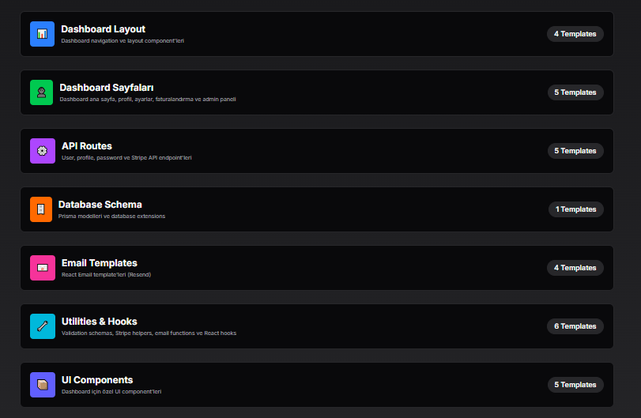
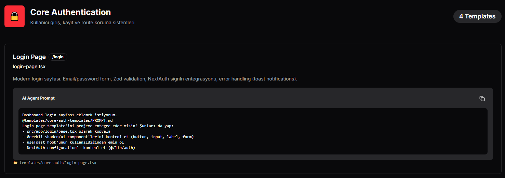

# Vibe Coding Starter

Next.js 16, TypeScript ve production-ready uygulamalar geliştirmek için ihtiyacınız olan tüm araçları içeren modern full-stack başlangıç kiti.

## 🚀 Yenilik - Template Sistemi v1.0

### ✨ 33 Production-Ready Template

Her biri AI agent uyumlu ve detaylı dokümantasyona sahip!

#### 📦 Template Kategorileri:

**1. Core Auth Templates** (4 template)
- Giriş Sayfası - E-posta/şifre formu + doğrulama
- Kayıt Sayfası - Şifre güç göstergesi
- Middleware - Route koruması
- Kayıt API - Kullanıcı kayıt endpoint'i

**2. Dashboard Layout Templates** (4 template)
- Dashboard Navbar - Yapışkan navbar + blur efekti
- Dashboard Sidebar - Navigasyon menüsü
- Kullanıcı Menüsü - Dropdown menü
- Mobil Menü - Responsive sheet menü

**3. Dashboard Sayfa Template'leri** (5 template)
- Dashboard Ana Sayfa - İstatistikler + hızlı işlemler
- Profil Sayfası - Profil yönetimi
- Ayarlar Sayfası - Sekmeli ayarlar
- Faturalandırma Sayfası - Stripe entegrasyonlu
- Yönetici Paneli - Kullanıcı yönetimi

**4. API Route Template'leri** (5 template)
- Kullanıcı API - CRUD işlemleri
- Profil API - Profil güncelleme
- Şifre API - Şifre değiştirme
- Stripe Ödeme API - Ödeme işlemi
- Stripe Webhook API - Webhook işleyici

**5. Veritabanı Şema Template'leri** (1 template)
- Şema Eklentileri - Subscription, Invoice, AuditLog modelleri

**6. E-posta Template'leri** (4 template)
- Hoş Geldin E-postası - Karşılama mesajı
- Şifre Sıfırlama E-postası - Şifre yenileme
- Fatura E-postası - Fatura bildirimi
- Abonelik E-postası - Abonelik yenileme

**7. Yardımcı Fonksiyon ve Hook Template'leri** (6 template)
- Doğrulama Şemaları - Zod validation
- Stripe Yardımcıları - Helper fonksiyonlar
- E-posta Yardımcıları - E-posta gönderme
- useAuth Hook - Kimlik doğrulama state yönetimi
- useUser Hook - Kullanıcı işlemleri
- useForm Hook - Form yönetimi

**8. UI Bileşen Template'leri** (5 template)
- İstatistik Kartı - Veri görselleştirme
- Veri Tablosu - Tablo gösterimi
- Boş Durum - Empty state gösterimi
- Yükleniyor Animasyonu - Loading spinner
- Hata Bildirimi - Error alert

### 🎯 Template Vitrin Sayfası

Tüm template'leri görsel olarak inceleyin:



```bash
npm run dev
# Ziyaret et: http://localhost:3000/templates
```

**Vitrin özellikleri:**
- 📊 8 kategoride 33 template
- 🔍 Her template için detaylı açıklama
- 🤖 Hazır AI agent prompt şablonları
- 📋 Tek tıkla kopyalanabilir prompt'lar
- ✅ Özellik listesi

### 🤖 AI Agent ile Kullanım

Her template için hazırlanmış prompt şablonu bulunur. Bu şablonları kopyalayıp AI agent'larınıza (Claude Code, Cursor, GitHub Copilot) yapıştırın.



#### Adım Adım Kullanım:

**1. Template Vitrin Sayfasını Açın:**
```
http://localhost:3000/templates
```

**2. İstediğiniz Template'i Seçin:**
- Kategoriye tıklayın
- Template'leri inceleyin
- Hazır prompt şablonunu kopyalayın

**3. AI Agent'a Gönderin:**
Kopyaladığınız prompt şablonunu AI agent prompt'unuza yapıştırın.

**Örnek Prompt:**
```
Dashboard giriş sayfası eklemek istiyorum.
@templates/core-auth-templates/PROMPT.md
Giriş sayfası template'ini projeme entegre eder misin? Şunları da yap:
- src/app/login/page.tsx olarak kopyala
- Gerekli shadcn/ui bileşenlerini kontrol et (button, input, label, form)
- useToast hook'unun kullanıldığından emin ol
- NextAuth yapılandırmasını kontrol et (@/lib/auth)
```

**4. AI Agent Otomatik Yapar:**
- ✅ Gerekli template dosyalarını bulur
- ✅ Projenize entegre eder
- ✅ Bağımlılıkları ekler
- ✅ Kurulum adımlarını takip eder

## Teknoloji Yığını

- **Framework:** Next.js 16 (App Router, Server Components, Turbopack)
- **Dil:** TypeScript
- **Stil:** Tailwind CSS 4 + shadcn/ui
- **Veritabanı:** PostgreSQL + Prisma ORM
- **Kimlik Doğrulama:** NextAuth.js + Prisma Adapter
- **Backend:** Supabase
- **Ödemeler:** Stripe
- **E-posta:** React Email + Resend
- **Formlar:** React Hook Form + Zod doğrulama
- **UI:** Framer Motion, Lucide Icons, Sonner (bildirimler)
- **Veri:** TanStack Query, Recharts
- **Güvenlik:** reCAPTCHA v3

## Başlarken

### Gereksinimler

- Node.js 18+
- PostgreSQL veritabanı (veya Supabase hesabı)
- Stripe hesabı (ödemeler için)
- Resend hesabı (e-postalar için)

### Kurulum

**1. Depoyu klonlayın:**

```bash
git clone https://github.com/eyaprak/vibe-coding-starter.git
cd vibe-coding-starter
```

**2. Bağımlılıkları yükleyin:**

```bash
npm install
```

**3. Ortam değişkenleri dosyasını kopyalayın:**

```bash
cp .env.example .env
```

**4. `.env` dosyasını yapılandırın:**
   - Veritabanı URL'i (Supabase PostgreSQL)
   - Supabase kimlik bilgileri
   - NextAuth gizli anahtarı
   - Stripe anahtarları
   - Resend API anahtarı
   - reCAPTCHA anahtarları

**5. Veritabanı şemasını gönderin:**

```bash
npm run db:push
```

**6. Geliştirme sunucusunu başlatın:**

```bash
npm run dev
```

Uygulamanızı görmek için [http://localhost:3000](http://localhost:3000) adresini açın.

## Template Sistemi Kullanımı

### 🎨 Template Vitrin Sayfası

```bash
npm run dev
# Ziyaret et: http://localhost:3000/templates
```

### 📂 Manuel Template Kullanımı

```
templates/
├── PROMPT.md                 # Ana rehber (tüm sistem)
├── core-auth-templates/      # Kimlik doğrulama template'leri
│   ├── PROMPT.md             # Kategori rehberi
│   ├── login-page.tsx        # Giriş template'i
│   ├── register-page.tsx     # Kayıt template'i
│   └── ...
└── ...
```

**Adım Adım:**
1. İlgili template kategorisini açın
2. `PROMPT.md` dosyasını okuyun
3. Template dosyasını projenize kopyalayın
4. Kurulum adımlarını takip edin

### 🤖 AI Agent ile Örnek Kullanım

**Senaryo 1: Giriş Sayfası**
```
1. /templates sayfasına git
2. Kimlik Doğrulama → Giriş Sayfası'nı seç
3. Prompt şablonunu kopyala:

Dashboard giriş sayfası eklemek istiyorum.
@templates/core-auth-templates/PROMPT.md
Giriş sayfası template'ini projeme entegre eder misin?

→ AI agent:
- templates/core-auth-templates/login-page.tsx'i okur
- src/app/login/page.tsx olarak kopyalar
- Gerekli shadcn/ui bileşenlerini ekler
- Middleware'i kurar
- Test eder
```

**Senaryo 2: Dashboard Düzeni**
```
1. /templates sayfasına git
2. Dashboard Düzeni → Dashboard Navbar'ı seç
3. Prompt şablonunu kopyala:

Dashboard navbar bileşeni eklemek istiyorum.
@templates/dashboard-layout-templates/PROMPT.md
DashboardNavbar bileşenini src/components/dashboard/navbar.tsx olarak ekler misin?

→ AI agent:
- Dashboard layout bileşenlerini ekler
- Layout dosyasını günceller
- Responsive tasarımı kontrol eder
```

**Senaryo 3: Profil Sayfasına Özellik Ekleme**
```
1. Mevcut profile-page.tsx'i kontrol et
2. Aşağıdaki prompt'u kullan:

Profil sayfasına telefon numarası alanı eklemek istiyorum.
@templates/dashboard-page-templates/PROMPT.md

→ AI agent:
- Mevcut profile-page.tsx'i inceler
- Form alanını ekler
- Doğrulama şemasını günceller
- API'yi günceller
- Prisma modelini günceller
```

## Proje Yapısı

```
├── prisma/
│   └── schema.prisma        # Veritabanı şeması
├── src/
│   ├── app/                 # Next.js App Router
│   │   ├── api/             # API rotaları
│   │   ├── (dashboard)/     # Dashboard rota grubu
│   │   ├── templates/       # 🆕 Template vitrin sayfası
│   │   ├── layout.tsx       # Ana layout
│   │   └── page.tsx         # Ana sayfa
│   ├── components/
│   │   └── ui/              # shadcn/ui bileşenleri
│   ├── hooks/               # Özel React hook'ları
│   ├── lib/                 # Yardımcı fonksiyonlar
│   │   ├── auth.ts          # NextAuth yapılandırması
│   │   ├── prisma.ts        # Prisma client
│   │   ├── supabase.ts      # Supabase client
│   │   └── utils.ts         # Yardımcı fonksiyonlar
│   └── types/               # TypeScript tipleri
├── templates/               # 🆕 Tüm template şablonları
│   ├── PROMPT.md            # Ana AI agent rehberi
│   ├── core-auth-templates/
│   ├── dashboard-layout-templates/
│   ├── dashboard-page-templates/
│   ├── api-route-templates/
│   ├── database-schema-templates/
│   ├── email-templates/
│   ├── utility-hook-templates/
│   └── ui-component-templates/
└── public/                  # Statik dosyalar
```

## Kullanılabilir Komutlar

| Komut                 | Açıklama                                   |
| --------------------- | ------------------------------------------ |
| `npm run dev`         | Turbopack ile geliştirme sunucusunu başlat |
| `npm run build`       | Production için derle                      |
| `npm run start`       | Production sunucusunu başlat               |
| `npm run lint`        | ESLint'i çalıştır                          |
| `npm run db:push`     | Prisma şemasını veritabanına gönder        |
| `npm run db:generate` | Prisma client'ı oluştur                    |

## Özellikler

### 🆕 Template Sistemi

- **33 Kullanıma Hazır Template** - Her biri production ready
- **AI Agent Uyumlu** - Claude Code, Cursor, Copilot ile çalışır
- **Kategorize Edilmiş** - 8 ana kategori
- **Dokümante Edilmiş** - Her template'te JSDoc yorumları
- **Prompt Şablonları** - Hazır AI agent prompt'ları
- **Detaylı Açıklamalar** - Her template için özellik listesi

### Kimlik Doğrulama

- Kimlik bilgisi tabanlı kimlik doğrulama
- JWT ile oturum yönetimi
- Korumalı rotalar hazır

### Veritabanı

- Roller ile kullanıcı modeli (USER, ADMIN)
- OAuth için hesap bağlama
- Oturum yönetimi

### Ödemeler (Stripe)

- Client ve server SDK hazır
- Webhook işleme kurulumu

### E-posta

- React Email bileşenleri
- Resend entegrasyonu

### UI Bileşenleri

- Button, Input, Card bileşenleri
- Karanlık mod desteği
- Bildirim mesajları

## Özelleştirme

### shadcn/ui Bileşenleri Ekleme

```bash
npx shadcn@latest add [bileşen-adı]
```

### Veritabanı Migrasyonları

`prisma/schema.prisma` dosyasını değiştirdikten sonra:

```bash
npx prisma db push
```

## Dağıtım

### Vercel (Önerilen)

1. GitHub'a gönderin
2. Vercel'de projeyi içe aktarın
3. Ortam değişkenlerini yapılandırın
4. Dağıtın

### Diğer Platformlar

Production paketini derleyin:

```bash
npm run build
npm run start
```

## Katkıda Bulunma

Katkılarınızı bekliyoruz! Lütfen bir issue açın veya pull request gönderin.

## Lisans

MIT Lisansı - bu starter'ı herhangi bir proje için kullanmakta özgürsünüz.

---

**⭐ Eğer bu proje işinize yaradıysa, lütfen bir yıldız vermeyi unutmayın!**
